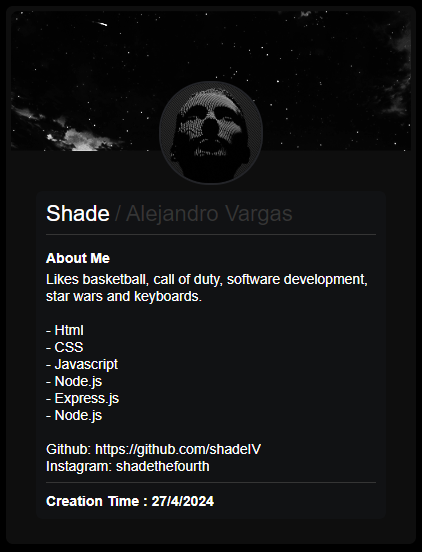

# Profilify

Profilify is a web application for creating and managing profile cards using HTML, CSS, JavaScript, Node.js, and Express.js. It allows users to create, edit, and store their unique profile cards directly within the application.

## Installation

Before you get started, make sure you have Node.js and npm installed on your system.

Follow these steps to install and use the project:

1. Clone the repository:

    ```bash
    git clone https://github.com/shadeIV/profilify.git
    ```

2. Install the required npm packages:

    ```bash
    npm install
    ```

3. To start the application:

    ```bash
    npm start
    ```

## Usage

Using Profilify is straightforward:

- Create, edit, and store your unique profile cards in the application.
- Simply type `npm start` in the command line to launch the server.
- Go to localhost:8080/home to access the home page.

Feel free to create profiles according to your imagination.

## Screenshot


